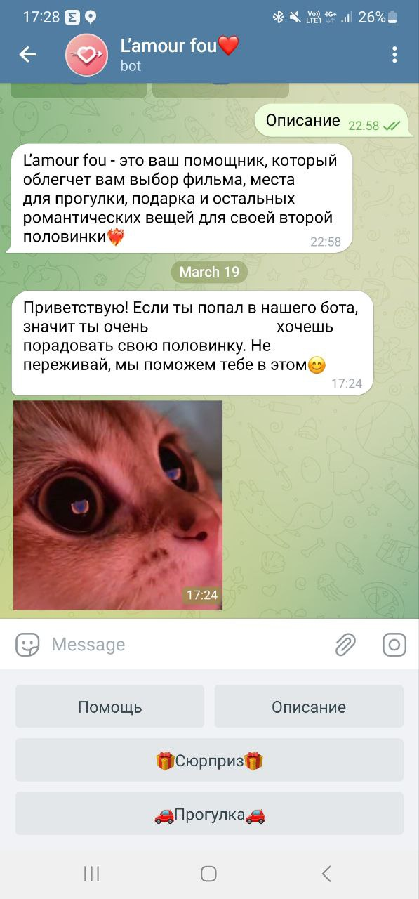

### Name of the project:
L'amour fou❤️

###  Team Lead:
Project Developers: Polina Backhman, Yashin Roman  
Teacher: Anatolyev Alexey Vladimirovich

### Description of the program and Project Description
Цель проекта: 
Создание чат-бота в телеграмме для влюбленных пар. Реализация таких
функций как: поиск красивых мест для прогулки, тест на совместимость, 
генератор неожиданных комплиментов, подборка милых товаров с WB и 
романтических фильмов  

Процесс работы программы:  
А) Description of the program; Б) Project Description 

1.а) Ввод пользователя команды "/start" приветствие пользователя,
знакомство с ботом.  
1.б) Начало работы чат-бота, представление чат бота пользователю. 
Открытие меню кнопок для работы с чат-ботом.
  
2.а) При нажатии пользователем кнопки "помощь" чат-бот отправит инструкцию
по работе с реализованными функциями, кнопки которых находятся в меню.  
2.б) Реализован отдельный декоратор для отправления пользователю сообщения
(соответствующей константы)

3.а) При нажатии пользователем кнопки "описание" чат-бот отправит сообщение,
определяющее возможности по работе с чат-ботом.  
3.б) Реализован отдельный декоратор для отправления пользователю сообщения
(соответствующей константы)

4.а) При нажатии пользователем кнопки "сюрприз" чат-бот предложит подборку
милых товаров для влюбленных.  
4.б) С помощью парсинга с сайта WB будут собраны данные о некоторых товарах.
Затем с помощью стрелочек пользователь сможет пролистывать ленту предложений.

4.а) При нажатии пользователем кнопки "прогулка" чат-бот покажет несколько
красивых мест, которые можно посетить со своей второй половинкой. 
Это может быть как интересный маршрут по городу, так и ресторан вкусной еды.  
4.б) Для этого необходимо будет создать базу данных с координатами разных
точек, а также необходимо обращение к API Яндекс.карт. Чат-бот будет 
присылать карту с меткой на необходимой точке.

4.а) При нажатии пользователем кнопки "тест на совместимость" чат-бот 
попросит ввести пользовательский знак зодиака и знак зодиака 
его половинки. А затем выведет процентный результат с описанием на 
несколько категорий.  
4.б) Для чат-бота будет реализован соответствующий декоратор, отвечающий за
появление сообщения в чате, для которого добавлены константы - результаты 
по процентам совместимости.

4.а) При нажатии пользователем кнопки "фильмы" чат-бот предложит подборку
романтических фильмов для влюбленных.  
4.б) С помощью парсинга с сайта будут собраны данные о некоторых фильмах.
Бот присылает краткий сюжет фильма и трейлер.
Затем с помощью стрелочек пользователь сможет пролистывать ленту предложений.

4.а) При нажатии пользователем кнопки "генератор комплиментов" чат-бот предложит
неожиданные милые комплименты для второй половинки.  
4.б) С помощью парсинга с сайта будут собраны данные о некоторых фильмах.
Бот присылает необычный комплимент. Пользователь может ставить оценки
комплименту и нажать кнопку "еще", для смены комплимента.

### Program code plan.

a. Переменные, константы: Понадобится множество констант, которые скорее всего
будут находиться в отдельном файле. Эти же константы и будут глобальными 
переменными. Это такие данные, как сообщения с результатами теста на совместимость
или генератор комплиментов. 
b. Функции: поиск красивых мест для прогулки; тест на совместимость; 
генератор неожиданных комплиментов; подборка милых товаров с WB и 
романтических фильмов.  
d. Библиотеки: aiogram для создания чат-бота и реализации всех его функций.
requests для отправки запросов на сервер. random - для представления
подборок с фильмами и товарами. json - для работы с API и данными на серверах. 

### Grafical interface

### Deadlines

| Задача                                         | Дата      |
|------------------------------------------------|-----------|
| Техническое задание (ТЗ)                       | 20 марта  |
| Код + Большая часть проекта                    | 3 апреля  |
| Код почти работает + черновики презентации, ПЗ | 18 апреля |
| Всё готово                                     | 23 апреля |

