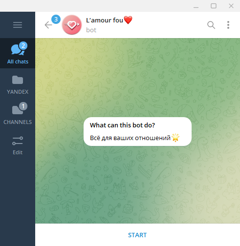
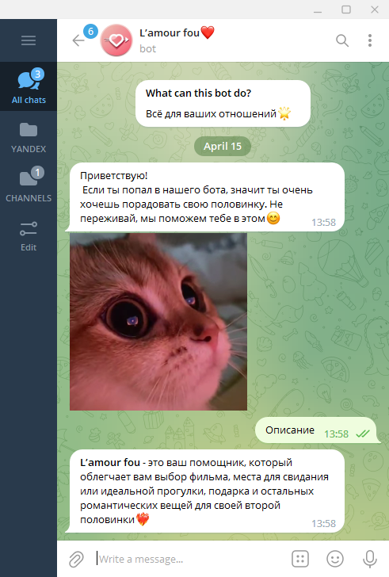
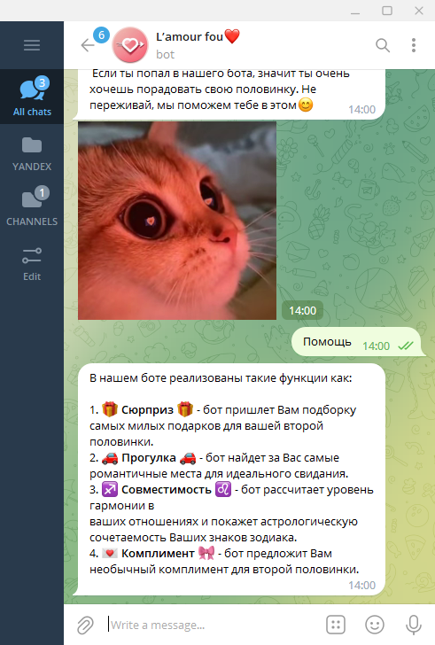

### Name of the project:  
# L'amour fou❤️

### Project Purpose 
Чат-бот создан для самых милых влюбленных пар. Наш помощник может:
1. посоветовать романтический фильм, от просмотра которого бегут мурашки по коже;
2. предложить лучшее место для идеального свидания;
3. подобрать нужный и приятный подарок для второй половинки; 
4. рассчитать уровень гармонии в отношениях и показать астрологическую совместимость;
5. Сделать необычный и яркий комплимент.

### Кол-во строк в проекте
265 строк кода в main.py  
411 строк кода в level1.py  
385 строк кода в level2.py  
272 строки кода в level3.py  
Итого: 1333 строки кода в проекте
ЭТО ПРИМЕР ИЗ PYGAME

### Ссылка на [**техническое задание**](materials/technical_specification.md)

### Установка и запуск

Для запуска приложения с использованием интерпретатора python рекомендуется использовать python3.9.
Предварительно необходимо установить все внешние библиотеки.

```sh
$ pip install -r requirements.txt
```


### Процесс работы пользователя с чат-ботом

- Начало работы с нашим чат-ботом не отличается от начала работы с любыми другими чат-ботами.  
То есть достаточно нажать на единственную кнопку "start"



- После нажатия на кнопку старт бот присылает приветствие. Также открывается клавиатура с 7ью кнопками...
ДОПИШИ

- Кнопка "Описание".  
При нажатии пользователем на эту кнопку, находящуюся на основной клавиатуре,
бот присылает сообщение с описанием своего функционала.



- Кнопка "Помощь".  
При нажатии пользователем на эту кнопку, находящуюся на основной клавиатуре,
бот присылает сообщение с описанием функций кнопок на клавиатуре.



СМЕНА ФОТОТОТОТОО

### Ссылка на [**скриншоты и скринкасты**]()

### Ссылка на [**проект на GitHub**](https://github.com/Crist1x/YANDEX_BOT_PROJECT)

### Username в телеграмме @romantic_support_bot