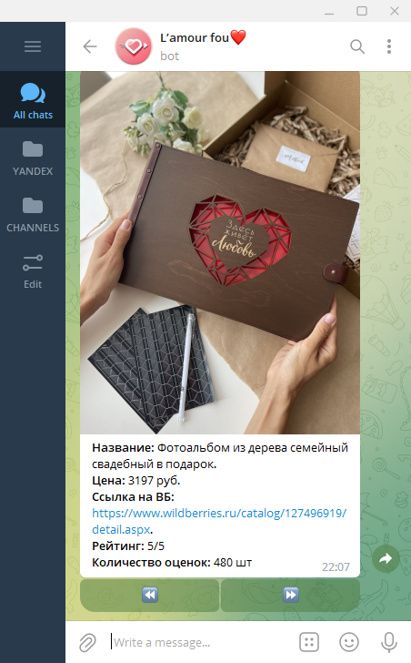
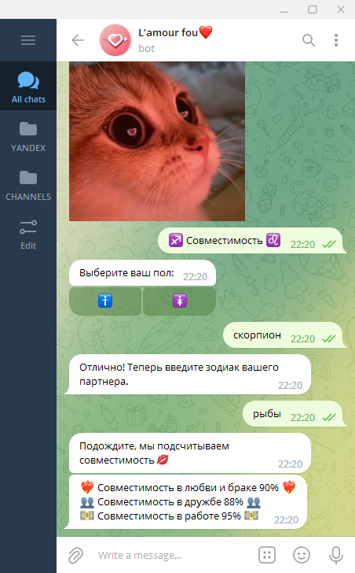

### Name of the project:  
# L'amour fou❤️

### Project Purpose 
Чат-бот создан для самых милых влюбленных пар. Наш помощник может:
1. посоветовать романтический фильм, от просмотра которого бегут мурашки по коже;
2. предложить лучшее место для идеального свидания;
3. подобрать нужный и приятный подарок для второй половинки; 
4. рассчитать уровень гармонии в отношениях и показать астрологическую совместимость;
5. Сделать необычный и яркий комплимент.

### Кол-во строк в проекте
265 строк кода в main.py  
411 строк кода в level1.py  
385 строк кода в level2.py  
272 строки кода в level3.py  
Итого: 1333 строки кода в проекте
ЭТО ПРИМЕР ИЗ PYGAME

### Ссылка на [**техническое задание**](materials/technical_specification.md)

### Установка и запуск

Для запуска приложения с использованием интерпретатора python рекомендуется использовать python3.9.
Предварительно необходимо установить все внешние библиотеки.

```sh
$ pip install -r requirements.txt
```


### Процесс работы пользователя с чат-ботом

- Начало работы с нашим чат-ботом не отличается от начала работы с любыми другими чат-ботами.  
То есть достаточно нажать на единственную кнопку "start"


- После нажатия на кнопку старт бот присылает приветствие. Также открывается клавиатура с 7ью кнопками...
ДОПИШИ

- Кнопка "Описание".  
При нажатии пользователем на эту кнопку, находящуюся на основной клавиатуре,
бот присылает сообщение с описанием своего функционала.  
Реализация декоратора message_handler по реакции (отправлению сообщения) на текст "описание".


- Кнопка "Помощь".  
При нажатии пользователем на эту кнопку, находящуюся на основной клавиатуре,
бот присылает сообщение с описанием функций кнопок на клавиатуре.  
Реализация декоратора message_handler по реакции (отправлению сообщения) на текст "помощь".


СМЕНА ФОТОТОТОТОО

- Кнопка "🎁 Сюрприз 🎁".  
Чат-бот отправляет пользователю подборку милых подарков.
В сообщении предоставлена краткая, наиболее важная информация по товару: картинка,
название, цена, рейтинг, кол-во отзывов и ссылка на товар на Wildberries.
Для перелистывания сюрпризов можно нажать на кнопку под его описанием. 
Всего представлено 18 приятных сюрпризов для Вашей второй половинки.  
Информация берется с сайта ВБ, она находится в файле config.py константе STUFF.
С помощью инлайн клавиатуры пользователь может прокручивать ленту с товарами, для чего также
реализована обработка колбэков на нажатие стрелки.



- Кнопка "♐️ Совместимость ♌️"
Наш бот может показать совместимость двух знаков зодиака.
Для этого необходимо выбрать свой пол и ввести свой знак зодиака, 
после чего указать знак зодиака Вашего партнера. 
Через некоторое время, за которое бот подсчитает сочетаемость знаков зодиака,
бот отправит сообщение с процентной совместимостью в трех видах отношений: в любви и браке,
в дружбе и в работе.  
После указания знаков зодиака они сохраняются в переменные, далее парсится сайт,
переменные введенные пользователем отправляются на сайт, забирается результат, 
полученные данные выводятся чат-ботом в сообщении. 
Для работы функции реализована машина состояний, помогающая работать с сайтом.



- Кнопка "💌 Комплимент 🎀"
Если Вы не можете подобрать самый волшебный комплимент для своей второй половинки,
наш бот может помочь Вам подобрать его. Предварительно необходимо
указать пол, для которого будет отправлен оригинальный комплимент.  
Комплименты собраны в базе данных sqlite3 таблице Compliments, 
оттуда рандомно берутся комплименты либо для парня, либо для девушки.


- Кнопка "🚗 Прогулка 🚗"  
Открывается инлайн клавиатура 
с возможными городами на выбор: Москва или Санкт-Петербург. После определения города бот
отправляет подборку самых романтичных мест в том или ином городе для проведения свидания.
Пользователь может пролистывать разные места с помощью стрелок на клавиатуре. В сообщении
от чат-бота приходит фотография места, его название и краткое описание, а также ссылка
для получения дополнительной, более подробной информации. При нажатии на кнопку "Показать на карте"
бот может также отправить карту с меткой, где находится то или иное место.  
Для реализации данной функции понадобилось составить две базы данных: для Москвы - Sights,
для СПБ - Sights_SPB. Были созданы обработчики соответствующих колбэков. 


- Бот может отвечать на все запросы во время работы кода программы.
Пользователь может завершить работу с чатом удалив его или очистив историю.

### Ссылка на [**скриншоты и скринкасты**]()

### Ссылка на [**проект на GitHub**](https://github.com/Crist1x/YANDEX_BOT_PROJECT)

### Username в телеграмме @romantic_support_bot